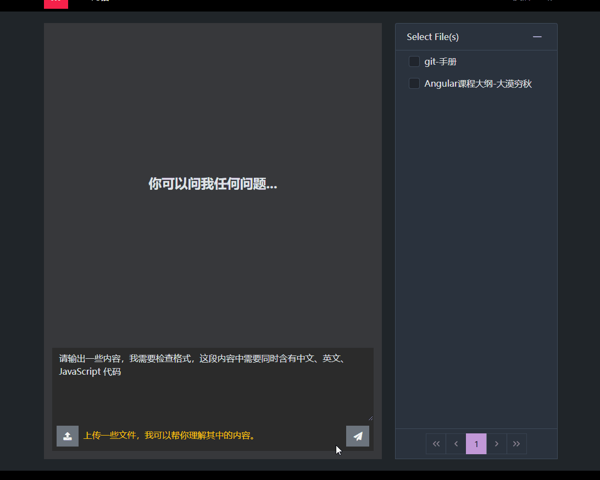
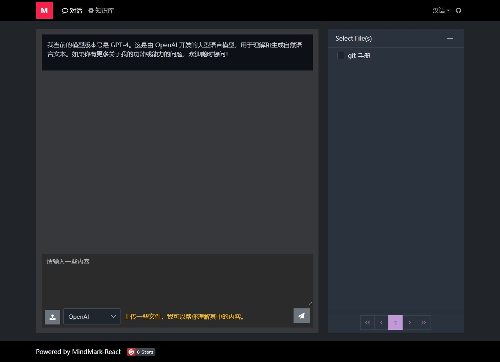
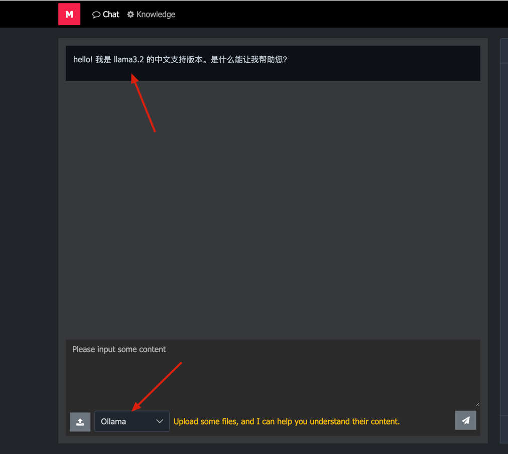
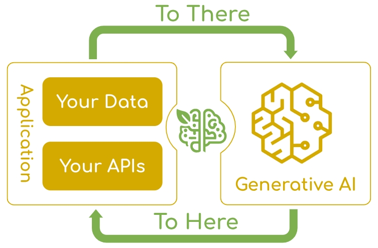

<p align="center">
    
</p>

<h1 align="center">MindMark</h1>

<p align="left">
🚀🚀🚀MindMark（心印）是一款基于 SpringAI 和 AIGC 的问答系统， 采用 RAG 架构，可以和基于 Spring 体系的业务系统进行无缝集成。
</p>

<p>
🚀🚀🚀请不要吝惜你的⭐️ Star ⭐️，星星越多，动力越足。🚀🚀🚀
</p>

## 1.注意

SpringAI 项目整体上处于预览阶段，并没有正式发布版本，请勿把本项目的代码用于实际业务系统。

## 2.主要依赖

| 模块 | 版本 | 说明 |
| --- | --- | --- |
| OpenJDK 20 | JDK >=18 | 小于 18 的版本可能存在兼容性问题，未测试。 |
| SpringAI | 1.0.0-SNAPSHOT | [https://docs.spring.io/spring-ai/reference/index.html](https://docs.spring.io/spring-ai/reference/index.html) |
| ElasticSearch | 8.17.0 | [https://www.elastic.co/elasticsearch](https://www.elastic.co/elasticsearch) |
| Apache Shiro | 1.12.0 | [https://shiro.apache.org/](https://shiro.apache.org/) |
| MariaDB | >=10.0 | [https://mariadb.org/](https://mariadb.org/) |

## 3.准备工作

### 3.1 创建大模型账号

MindMark 已经测试了 Gitee 和 Zhipu 的大模型。

| 模型 | 说明 |
| --- | --- |
| Gitee 大模型 | 前往 https://ai.gitee.com/ 注册并获得一个 api-key |
| 智谱大模型 | 在智谱大模型注册并完成实名认证，然后获得一个 api-key ，[https://open.bigmodel.cn/](https://open.bigmodel.cn/) |
| Ollama | Ollama 本地大模型，本项目实现的是 llama3.2，可以根据需求自行替换，[https://ollama.com/](https://ollama.com/) |

**把获得的 api-key 配置到 mindmark-llm-connector/src/main/resources/application.yml 中，SpringAI 支持同时配置多个模型。**

### 3.2 ElasticSearch 安装配置

拉取 Docker 镜像：

```bash

docker pull docker.elastic.co/elasticsearch/elasticsearch:8.17.0

```

启动容器：

```bash
  docker run -d --name elasticsearch \
  -e "discovery.type=single-node" \
  -e "xpack.security.enabled=false" \
  -e "xpack.security.transport.ssl.enabled=false" \
  -e "xpack.security.http.ssl.enabled=false" \
  -e "ES_JAVA_OPTS=-Xms8g -Xmx8g" \
  -p 9200:9200 \
  -p 9300:9300 \
  docker.elastic.co/elasticsearch/elasticsearch:8.17.0
```

**请注意：以上启动方式禁用了 SSL ，这是为了本地开发方便，对于生产系统，请启用 SSL 。**

观察启动日志

```bash
docker logs -f elasticsearch
```

打开浏览器，测试 ElasticSearch 是否正常运行：

http://192.168.0.105:9200/

安装 Kibana 图形界面并连接 ElasticSearch

```bash
docker run -d --name kibana -p 5601:5601 --link elasticsearch:elasticsearch docker.elastic.co/kibana/kibana:8.17.0
```

观察启动日志

```bash
docker logs -f kibana
```

打开浏览器，测试 Kibana 是否正常运行： http://192.168.0.105:5601/

其它安装配置方式请参考 ElasticSearch 官方文档： https://hub.docker.com/_/elasticsearch/

### 3.3 MariaDB 安装配置

省略 MariaDB 安装配置过程， MySQL 也可以。

在你的 MariaDB 中创建一个数据库，名称为 mind-mark ，创建时请选择 utf8mb4 作为字符集，避免产生非英文字符的乱码。创建完整之后，然后把此项目下的 /docs/mind_mark.sql 建表脚本导入进去，这些是 MindMark 自己使用的表。

PDM 模型如下：


pdm 模型文件在 /docs/mind_mark.pdm 中，可以使用 PowerDesigner 查看和编辑。

### 3.4 Ollama 的安装配置

根据[官网](https://ollama.com/download)上的提示下载安装对应操作系统的 ollama ，并运行对应模型，以本项目已经测试 llama3.2

```bash
ollama run llama3.2:latest
```

## 4. 启动项目

- 拉取本项目
- 修改配置文件（application.yml 和 application-druid.yml 中有一些配置项需要改成你自己的配置）
- 启动 MindMarkApplication.java

**备注：在启动时，有一些异常信息可以无视，只要能够正常访问即可。**

## 5.测试效果

### 5.1 准备数据

MindMark 能够监控两种类型的数据：

- 监控其它数据库中的表，把表中的数据全部向量化。
- 监控文件，解析文件中的内容并向量化。

#### 5.1.1 让 MindMark 监控指定的数据库表

你可以指定 MindMark 监控其它数据库中的表， MindMark 会把你指定的表中的所有数据全部向量化，并存储到 ElasticSearch 中，处理过程会分页。

**注意：在 MindMark 当前的实现中，被监控的表必须带有自增主键，否则 MindMark 无法把表中的数据进行向量化，因为不能记录已经处理了哪些数据行，在后续的版本中再考虑改进。你需要按照自己的情况，指定 MindMark 去监控哪个库中的哪张表，如果不提供这些配置， MindMark 不会监控任何数据库。**

#### 5.1.2 让 MindMark 监控文件

你可以通过 MindMark 的文件上传接口上传一些文件， MindMark 会把这些文件全部向量化，并存储到 ElasticSearch 中。目前支持的文件格式有：pdf/txt/markdown/doc/docx/ppt/pptx/xls/xlsx/json 。

**请注意：某些大模型接口是按照 Token 数量收费的，所以请不要上传太大的文件，否则会产生高额的费用。**

### 5.2 测试接口

MindMark 对应的前端项目位于： https://gitee.com/mumu-osc/mind-mark-react




也可以使用 Postman 来测试接口（直接用 Chrome 浏览器也可以测试）。


切换不同的模型：



 

## 6.系统架构



## 7.参考资源

- SpringAI 官方文档：https://docs.spring.io/spring-ai/reference/index.html
- Gitee AI 官方文档： https://ai.gitee.com/
- 智谱大模型官方文档： https://open.bigmodel.cn/
- Apach Shiro 权限控制详细解释： https://my.oschina.net/mumu

## 8.License

MIT

（补充声明：您可以随意使用此项目，但是本人不对您使用此项目造成的任何损失承担责任。）
